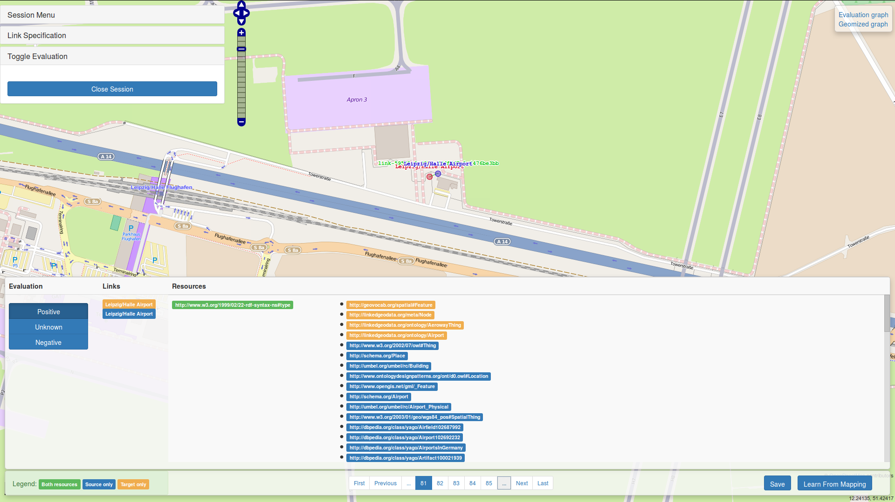

Geolink-SWP
===========

UI for data driven interlinking based on Limes and Jassa



* Don't forget to run `mvn install` in order to build the frontend!

Import the project into the IDE of your choice (using maven import)
Run the main class org.aksw.geolink.web.main.MainGeolinkServer as a Java application.
This will start jetty server running the app on port 7532


For the latest version of nodejs, run:
```
sudo apt-get install python-software-properties
sudo apt-add-repository ppa:chris-lea/node.js
sudo apt-get update
```

To set up the build tools, run
```bash
sudo apt-get install maven
sudo apt-get install nodejs
sudo npm install -g bower
sudo npm install -g grunt-cli
```

With your user account run:

```bash
mvn clean install
```


Visit:

* [http://localhost:7532](http://localhost:7532) to see a [jassa-ui map](https://github.com/GeoKnow/Jassa-UI-Angular) on DBpedia.
* [http://localhost:7532/api/sparql](http://localhost:7532/api/sparql) to see how to use the SPARQL base servlet.


